# Execution Plan — Student Analytics Portfolio Revamp

## Prior context and approval

Sources: current reverse-engineering architecture/inventory/stack/dependencies; approved requirements with answered verification questions; approved eight stories and three personas. This plan supersedes the previous template-onboarding execution plan for the active revamp. Historical approvals remain in the append-only audit.

## Detailed analysis

- Transformation: owner/content replacement and visual redesign within one React/Vite application, using its existing two-template architecture.
- User-facing impact: new student identity, analytics-focused evidence, new visual theme, relevant section organization, and explicit contact placeholders.
- Structural impact: retain App-owned navigation/layout/preferences and the registry; adapt existing section components and remove obsolete section dependencies. No services or separate packages are introduced.
- Data impact: update the existing typed portfolio records and section contract; represent leadership using existing resume-style records. Make absent images/evidence and placeholder contact status explicit where required. There is no database/schema migration or new analytical algorithm.
- Internal contracts: coordinate section IDs/maps, data fields, navigation helpers, and tests. No external API change.
- Quality impact: new color combinations and content density require accessibility/contrast/responsive verification; visual asset choices must remain lightweight.
- Deployment: keep static GitHub Pages and the existing base-path configuration; no infrastructure resource or hosting change.

## Component relationships and change priority

| Area | Change | Reason and priority |
| --- | --- | --- |
| Types and data | Important contract/content updates | Both templates must share accurate student facts, optional evidence, and placeholder status. Critical. |
| App, layout/navigation utilities | Focused compatibility updates | Remove old destinations, preserve section actions in both layouts, handle stale routes safely. Critical. |
| Existing Engineering/Business shells and section components | Visual/content changes | Analytics theme, evidence cards, community presentation, and usable controls. Critical. |
| CSS/theme tokens | Broad visual update within current style boundaries | Ivory/ink, teal/chartreuse, focus/contrast/reduced-motion consistency. Critical. |
| Assets and metadata | Content cleanup and branding | Remove stale owner imagery/docs, preserve both DOCX inputs, correct title/favicon/resume access. Critical. |
| Tests | Update relevant expectations and behaviors | Student data, retired routes, retained modes, placeholder contact, and asset resolution. Important. |
| GitHub Actions/Vite deployment | Retain existing configuration | Verify compatibility; no planned hosting changes. Supporting. |

Dependency flow: typed content/section contract -> navigation/registry -> existing shells and sections -> CSS/assets -> integrated verification. This is one package with coordinated module updates, not a multi-package release.

## Risk assessment

- Risk: medium because content, routes, two templates, styling, and assets change together.
- Main failure modes: deleting still-imported assets, leaving retired links active, inconsistent facts between styles, unreadable dark-mode accents, and scroll-only actions in section layouts.
- Rollback complexity: moderate; use reviewable repository diffs and avoid commits/deployment until separately requested. Preserve user documents and unrelated changes.
- Testing complexity: moderate; existing tests plus focused interaction/visual checks cover the changed boundaries.

## Workflow visualization

```mermaid
flowchart TD
    Start["Student analytics revamp"]
    WD["Workspace Detection - COMPLETED"]
    RE["Reverse Engineering - COMPLETED"]
    RA["Requirements Analysis - COMPLETED"]
    US["User Stories - COMPLETED"]
    WP["Workflow Planning - REVIEW"]
    AD["Application Design - SKIP"]
    UP["Units Planning - SKIP"]
    UG["Units Generation - SKIP"]
    FD["Functional Design - SKIP"]
    NFRA["NFR Requirements - EXECUTE"]
    NFRD["NFR Design - EXECUTE"]
    ID["Infrastructure Design - SKIP"]
    CG["Code Generation - EXECUTE"]
    BT["Build and Test - EXECUTE"]
    OPS["Operations - PLACEHOLDER"]
    End["Workflow complete"]
    Start --> WD
    WD --> RE
    RE --> RA
    RA --> US
    US --> WP
    WP --> AD
    AD --> UP
    UP --> UG
    UG --> FD
    FD --> NFRA
    NFRA --> NFRD
    NFRD --> ID
    ID --> CG
    CG --> BT
    BT --> OPS
    OPS --> End
    style WD fill:#4CAF50,stroke:#1B5E20,stroke-width:3px,color:#fff
    style RE fill:#4CAF50,stroke:#1B5E20,stroke-width:3px,color:#fff
    style RA fill:#4CAF50,stroke:#1B5E20,stroke-width:3px,color:#fff
    style US fill:#4CAF50,stroke:#1B5E20,stroke-width:3px,color:#fff
    style WP fill:#4CAF50,stroke:#1B5E20,stroke-width:3px,color:#fff
    style AD fill:#BDBDBD,stroke:#424242,stroke-width:2px,stroke-dasharray:5 5,color:#000
    style UP fill:#BDBDBD,stroke:#424242,stroke-width:2px,stroke-dasharray:5 5,color:#000
    style UG fill:#BDBDBD,stroke:#424242,stroke-width:2px,stroke-dasharray:5 5,color:#000
    style FD fill:#BDBDBD,stroke:#424242,stroke-width:2px,stroke-dasharray:5 5,color:#000
    style NFRA fill:#FFA726,stroke:#E65100,stroke-width:3px,stroke-dasharray:5 5,color:#000
    style NFRD fill:#FFA726,stroke:#E65100,stroke-width:3px,stroke-dasharray:5 5,color:#000
    style ID fill:#BDBDBD,stroke:#424242,stroke-width:2px,stroke-dasharray:5 5,color:#000
    style CG fill:#4CAF50,stroke:#1B5E20,stroke-width:3px,color:#fff
    style BT fill:#4CAF50,stroke:#1B5E20,stroke-width:3px,color:#fff
    style OPS fill:#BDBDBD,stroke:#424242,stroke-width:2px,stroke-dasharray:5 5,color:#000
    style Start fill:#CE93D8,stroke:#6A1B9A,stroke-width:3px,color:#000
    style End fill:#CE93D8,stroke:#6A1B9A,stroke-width:3px,color:#000
    linkStyle default stroke:#333,stroke-width:2px
```

Text alternative: completed Workspace Detection -> Reverse Engineering -> Requirements Analysis -> User Stories -> Workflow Planning review. Skip separate Application Design, Units Planning/Generation, and Functional Design. Execute concise NFR Requirements -> NFR Design. Skip Infrastructure Design. Execute Code Generation planning/approval -> implementation/review -> Build and Test. Operations remains the workflow placeholder.

## Stage decisions

| Stage | Decision | Depth and rationale |
| --- | --- | --- |
| Workspace Detection | Completed | Existing application and source documents confirmed. |
| Reverse Engineering | Completed/approved | Current two-template architecture and source evidence reviewed. |
| Requirements Analysis | Completed/approved | Student scope, dates, placeholders, theme, and extensions resolved. |
| User Stories | Completed/approved | Eight stories and three personas; requirement coverage checked. |
| Workflow Planning | Execute; review pending | Standard scope/sequence and stage selection. |
| Application Design | Skip | Adapt existing App, template, section, and shared-UI boundaries; no new service or independent component architecture needed. |
| Units Planning/Generation | Skip | One cohesive frontend unit; no separate service/package decomposition. |
| Functional Design | Skip | Source-backed display records and simple placeholder/route conditions; no complex business rules, new database model, or analytics computation. |
| NFR Requirements | Execute | Minimal: confirm accessibility, responsiveness, asset weight, reliability, and compatibility criteria already stated in requirements. |
| NFR Design | Execute | Minimal: map those criteria to current theme tokens, controls, reduced-motion behavior, asset choices, and verification. |
| Infrastructure Design | Skip | Hosting/build architecture already defined; no infrastructure change. |
| Code Generation | Execute | Standard: explicit checkbox plan, approval, implementation, and required review. |
| Build and Test | Execute | Run appropriate checks and generate all required build/test instruction artifacts; document N/A performance-load testing for a static UI where appropriate. |
| Operations | Placeholder | No deployment/publishing is requested in this workflow. |

Four stages remain to execute after this plan's approval: NFR Requirements, NFR Design, Code Generation, and Build and Test. Each keeps its AI-DLC review gate. There is one implementation unit, `student-analytics-portfolio`.

## Package/module change sequence

1. Finalize concise NFR criteria/design for the existing frontend.
2. Prepare the code-generation checkbox plan with exact affected files and coordinated section/type updates.
3. Update shared identity, academic/internship/project/learning/community content and placeholder configuration.
4. Adapt existing section maps/navigation and rendering for the retained content; remove obsolete journal/media routes/evidence.
5. Restyle shells, hero, section headings/cards, project evidence, skills, and contact for the analytics theme in both color modes.
6. Replace old portrait/logo/project imagery with honest abstract/code-native visuals; wire the supplied student resume download and metadata.
7. Remove old assets/content/components only after resolving references; preserve both source DOCX files.
8. Update applicable existing tests; verify interaction behavior, accessibility, responsive presentation, lint, and TypeScript/Vite build.
9. Generate required build/test instructions and summarize results with material limits.

Module dependencies are updated sequentially at contract boundaries. No sub-agents, multi-package version rollout, infrastructure provisioning, or new external data services are required.

## Verification checkpoints and success criteria

- Data fidelity: source-backed high-school profile; report internship dates; correct F1/rank and project findings; no blank GPA or invented claims.
- Interaction: both templates, both layouts, both color modes, mobile menu, hash navigation/stale-route fallback, saved preferences, resume access, and inactive placeholder channels.
- Visual: default analytics theme across retained sections; responsive widths including 320px; keyboard focus, text/control contrast, and reduced motion.
- Cleanup: no former-owner content on active routes or retired direct links; no broken asset imports; supplied DOCX files retained.
- Automated: relevant tests, ESLint, and TypeScript/Vite production build pass. Broaden/repeat checks only when failures or further changes justify it.
- Delivery: working local code and build/test documentation; no automatic publication. If browser visual tooling is unavailable, record that limitation and perform feasible static/runtime checks.

## Planning progress

- [x] Record generated-story/persona approval and load prior context.
- [x] Assess scope, component relationships, risks, and module dependencies.
- [x] Determine applicable stages and depth for one frontend unit.
- [x] Validate the workflow diagram and include a text alternative before writing.
- [x] Create the execution plan and update state/audit.
- [x] Obtain explicit execution-plan approval — user: "approve and continue".

## Remaining execution progress

- [x] NFR Requirements — criteria and stack artifacts generated.
- [x] NFR Requirements artifact approval.
- [x] NFR Design — existing UI/theme design artifacts generated.
- [x] NFR Design artifact approval.
- [x] Code Generation Part 1 — detailed plan prepared.
- [x] Code Generation plan approval.
- [x] Code Generation Part 2 — implementation and review.
- [x] Build and Test — checks, instruction artifacts, and review.

## Estimated effort

A focused multi-file frontend revamp across four remaining stages. Exact elapsed time depends on review responses and verification results; no fixed delivery date is assumed.

## Extension compliance

Security Baseline: N/A, explicitly disabled (B). Property-Based Testing: N/A, explicitly disabled (C). Full rules remain unloaded; enforcement skipped. Accessibility, correctness, and existing build/test checks remain required by approved website requirements.

## User control

You may request changes or include any skipped stage. Approval advances to NFR Requirements; it does not remove the later review gates specified by the AI-DLC workflow.
