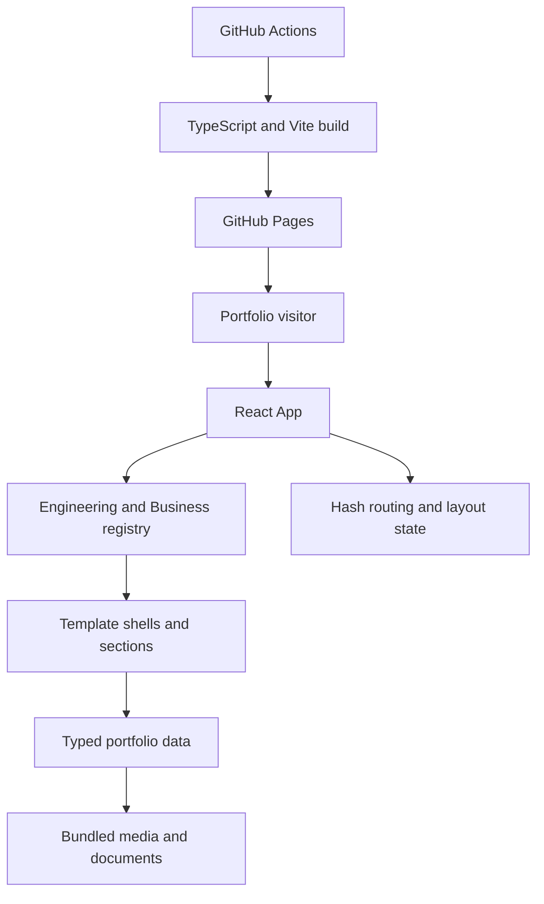
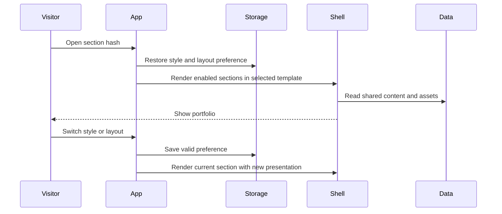

# System Architecture

## Overview

One React 19 / TypeScript / Vite static application. `PortfolioApp` owns template selection, section navigation, layout state, and local journal routing. The registry contains exactly Engineering and Business. Source default is Engineering. Saved valid visitor preferences override that default.

## Architecture diagram

Text alternative: App resolves the two-template registry and hash/layout state, then renders template shells and sections using shared typed data and bundled assets. GitHub Actions builds the application with TypeScript and Vite and publishes it to GitHub Pages.

## Component boundaries

- Application: React state, browser hash synchronization, section visibility, and template resolution.
- Model: `PortfolioTemplate` requires shells, journal detail components, chapter labels, and complete section maps. Optional `isSectionVisible` supports additional filtering.
- Presentation: Engineering uses shared components; Business has dedicated components and scoped CSS.
- Shared UI: Chakra provider, color-mode controls, cards, external actions, logo marks, and style selector.
- Data: `src/data/portfolio.ts` aggregates typed content; local Markdown and assets are imported by data modules.
- Infrastructure: `.github/workflows/deploy.yml` builds and deploys static output. There is no backend, database, auth service, Terraform, or CDK package.

## Interaction diagram

Text alternative: A visitor opens a hash route; App restores browser preferences and renders the matching shell and shared content. Switching style or layout stores the valid choice and updates presentation while App retains navigation responsibility.

## Integrations

Browser history, local storage, scrolling, media dialogs, Google Fonts, outbound social/project/writing links, YouTube embeds, and mailto email composition. Contact submissions open an email client; no server delivers messages.

## Preservation and cleanup boundaries

Core experience comprises responsive navigation, section/hash views, light/dark mode, visitor display preferences, and resume access. Irrelevant owner-specific evidence and assets are content cleanup candidates. Both DOCX files remain source inputs. New analytics visuals must not imply unavailable project screenshots, measurements, or live datasets.
